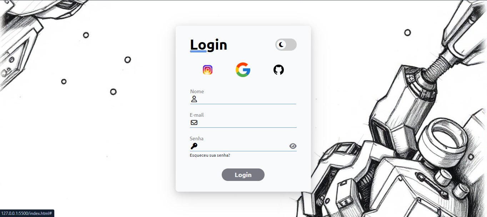
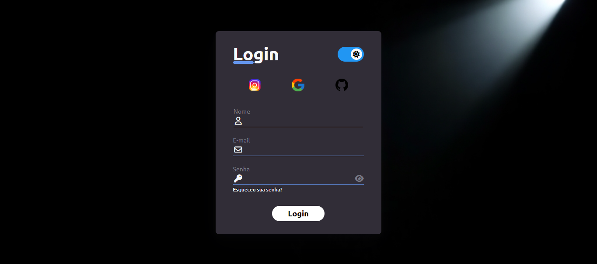

# Tela de Login

Este projeto é uma interface de tela de login responsiva, desenvolvida com HTML, CSS e JavaScript. Ele inclui suporte para alternância entre modo claro e escuro, ícone de exibição/ocultação de senha e links para login via redes sociais.

## 🚀 Tecnologias Utilizadas

- HTML

- CSS

- JavaScript

## 📌 Funcionalidades

- Formulário de login estilizado

- Alternância entre modo claro e escuro

- Ícone de olho para exibição/ocultação de senha

- Links para login via redes sociais

## 📸 Captura de Tela

## 📂 Estrutura de Arquivos

tela-de-login01/
├── assets/
│ ├── img/ (Imagens do projeto)
│ ├── style.css (Estilos do projeto)
│ ├── script.js (Lógica do JavaScript)
├── index.html (Página principal)
├── README.md
├── LICENSE

## 🎮 Como Usar

1. Clone este repositório:

2. Acesse o diretório do projeto:

3. Abra o projeto em um servidor local:

- Se você tiver o Python instalado, pode rodar um servidor simples

- Se estiver usando o VS Code, pode instalar a extensão Live Server para visualizar a página rapidamente.
